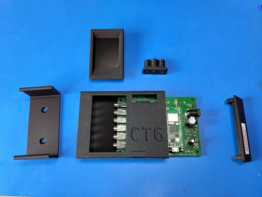
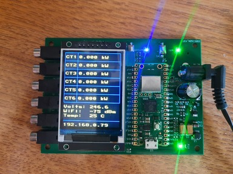
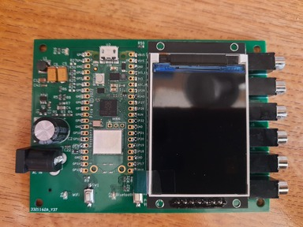
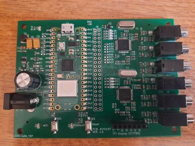
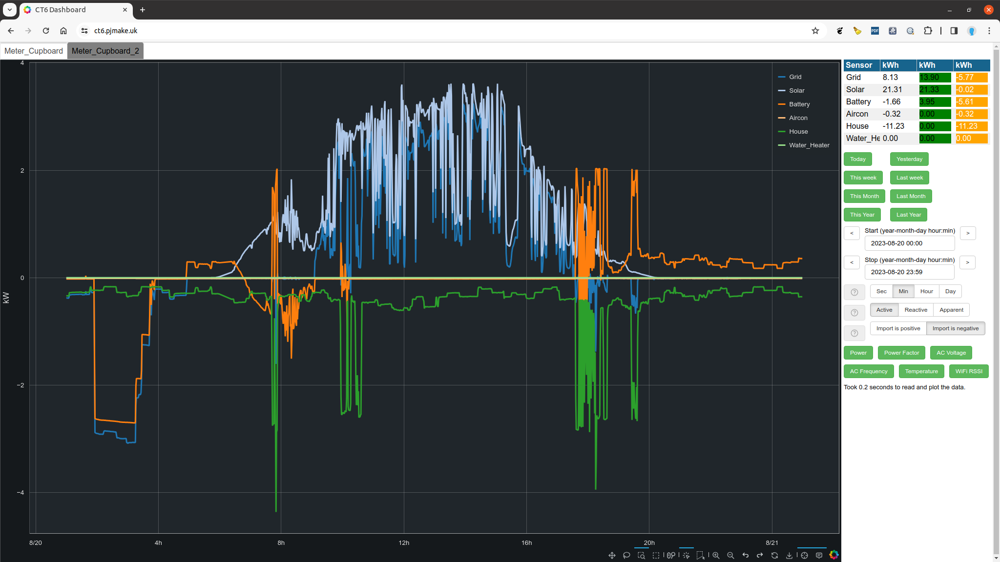

# CT6 Meter Project.
This project initially had the simple requirement.

- Monitor AC power usage on several ports.

Given this broad requirement I initially developed a hardware device that had
four ports connected to current transformers. This used an ESP32 microcontroller
and 16 bit ADC's to measure the current flow using the current transformers.
It became apparent that this approach had it's limitations which limited the
accuracy of the measurements. The main two limitations that concerned me were

- Not measuring the AC line voltage meant AC line voltage variation was not
  reflected in the power measurements.
- The direction of the AC power flow was not recorded.

After investigation I decided to use the [ATM90E32](https://www.microchip.com/en-us/product/ATM90E32AS) device as it has features that can fulfil both of the above requirements.

I also added an several requirements at this point.

- The ability to measure the following parameters
    - The RMS power (watts) from each port.
    - The Apparent power (watts) from each port.
    - The reactive power (watts) from each port.
    - The RMS current (amps) from each port.
    - The Peak current (amps) from each port.
    - The power factor for the power on each port.
    - The direction of the power from each port.
    - The RMS AC voltage.
    - The AC Frequency (Hz).
    - The WiFi RSSI (dBm).
    - The Temperature (°C).
- A display to show the power on each port.
- Single unit will have 6 ports rather than 4.
- If possible it would be useful to have the ability to stack units so that up to 24 ports could be monitored.

The development of this hardware involved schematic design, PCB layout, PCB manufacture and case design of this unit. The PCB was fabricated, assembled, tested and a 3D printed case was produced. The [hardware](hardware) folder contains details of the schematic/ PCB and  also the design for the 3D printed case. The [software](software) folder contains the source code for the CT6 unit firmware along with the other software required.

The images below show the CT6 unit.

This project also includes a web server that provides a useful user interface to access to the data provided by the above hardware. An example of this interface is shown below.

More information on this is detailed in the [CT6 App Server](software/ct6_app_server) folder in the software folder.

I also wrote an Android App that is used to connect the CT6 device to a WiFi network. An example of this interface is shown below. This can be used for other projects in the future as it interfaces to the generic micropython libraries (via bluetooth) I wrote for the CT6 project.

More information on this is detailed in the [Android App](software/Android_App/README.md) folder in the software folder.

# Purchasing CT6 units
Complete CT6 units or assembled PCB's and associated parts can be purchased on Tindie at https://www.tindie.com/products/pausten/ct6-energy-monitor/

# Discalimer
This project is designed to use the YHDC SCT013 100A 0-1V split core current transformer. No other current transformer is currently supported. As mains voltage is dangerous it is the users responsibility to connect these current clamps using this hardware.
