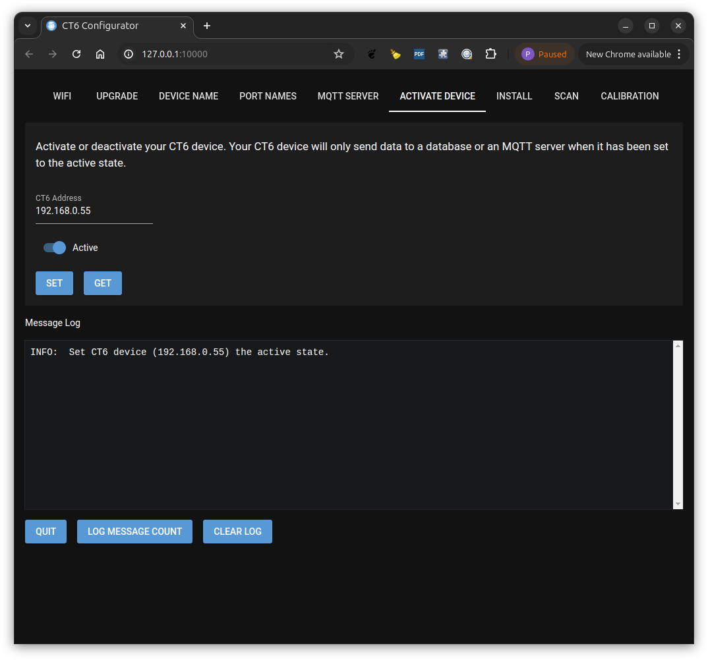
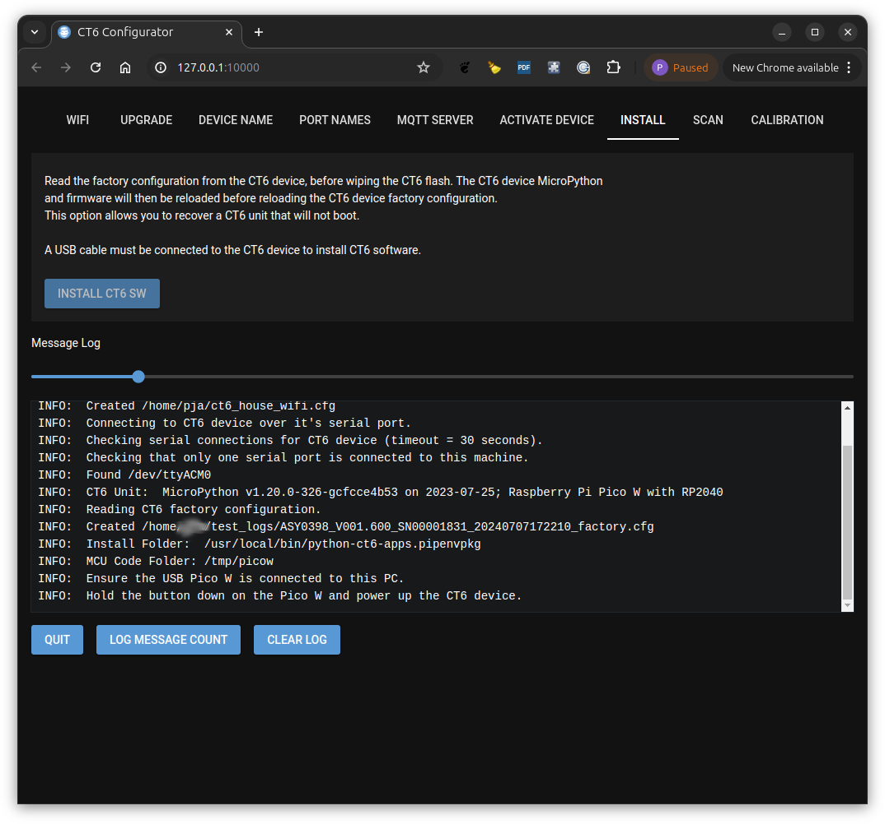
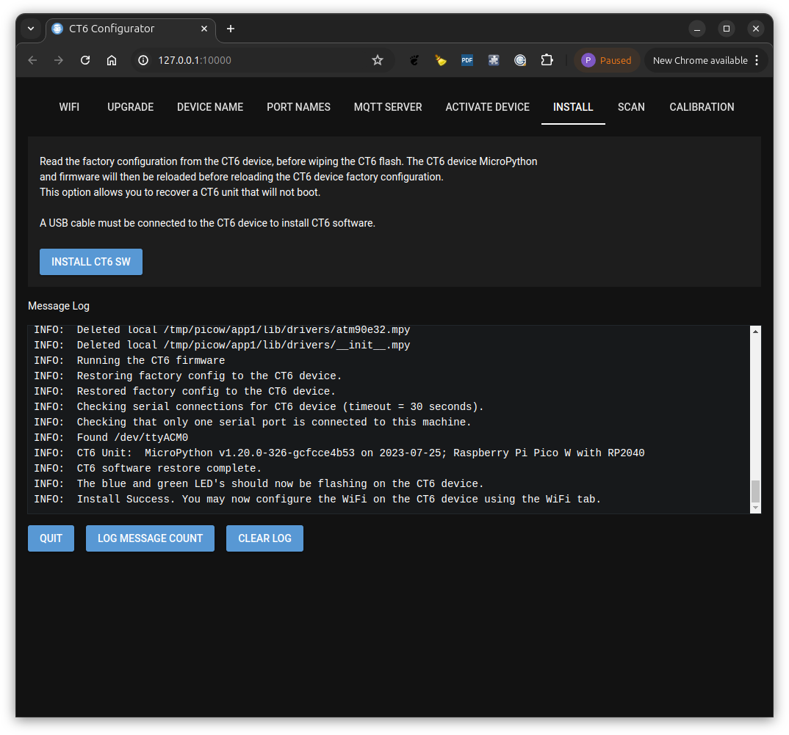
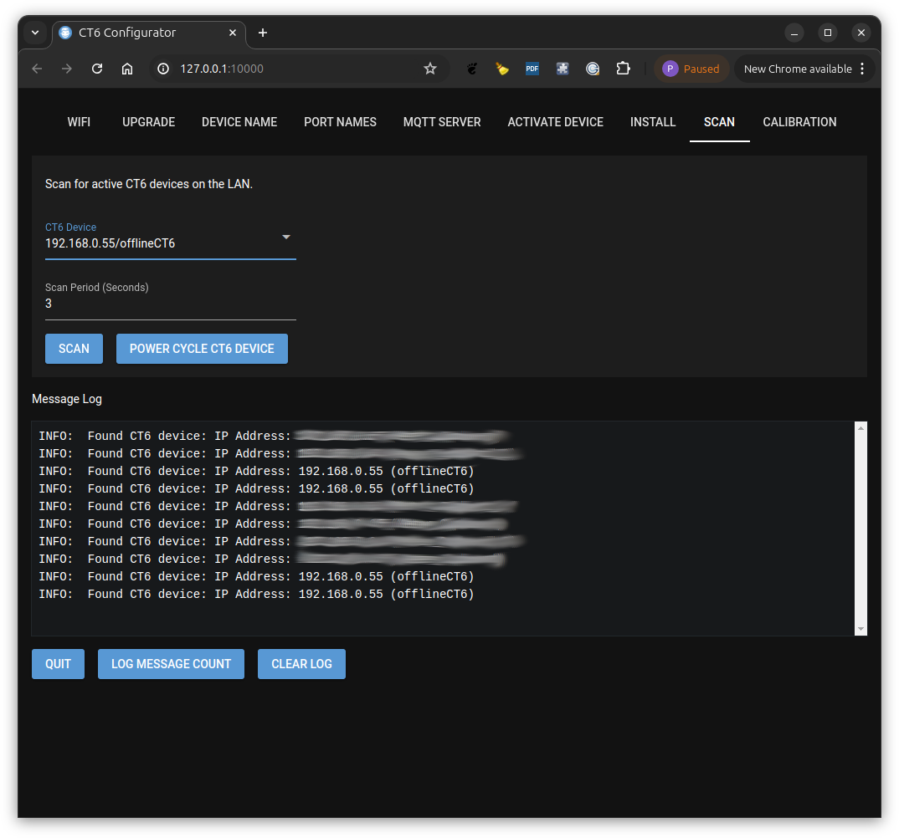
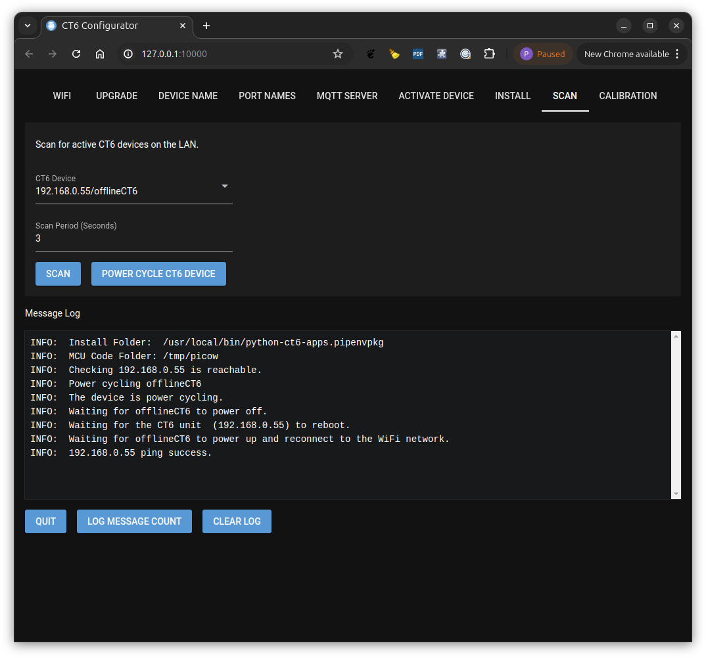

# Setting Up CT6 devices
Before using a CT6 unit it must be configured. This involves connecting it to a WiFi
network amongst other things. The CT6 software must be installed as detailed [here](installers/README.md) before setting up CT6 devices.

The ct6_configurator program allows you to setup your CT6 unit. Once the software has 
been installed the ct6_configurator software can be started as detailed below.

- Linux system
Enter 'ct6_configurator' in a terminal window.

- Windows System
The 'CT6 Configurator' App can be started from the windows Start button.

This command starts a local web server and then starts you systems web browser 
to this web server. The following browser window is displayed initially.


## WiFi Configuration

The first thing you need to do when you receive a CT6 device is connect it to 
your WiFi network. The WiFi tab is the first tab an is selected by default when the 
web browser starts. In order to setup the WiFi interface on the CT6 device a USB cable
must be connected from your Windows or Linux computer to the USB interface of the CT6 
device.

The USB interface of the RPi Pico W device inside the CT6 can be accessed by removing
the small panel on the lower edge of the unit that covers the USB port.

 

 Once the cable is connected and the CT6 device is powered up enter the WiFi SSID and 
 WiFi password of your WiFi network. Then select the 'Setup WiFi' button. When complete 
you should see messages similar to those shown below. 


The CT6 device should then show it's IP address at the bottom of the display as shown 
below.

 


 ## Upgrade the CT6 firmware.

 After the WiFi has been setup you should upgrade the CT6 devices firmware to the latest version using 
 the Upgrade tab. The CT6 firmware will be upgraded over your WiFi network. To do this select the 
 Upgrade tab, ensure the IP address is the same IP address that is displayed on the display of the 
 CT6 device and then select the 'Upgrade CT6 Device' button. The upgrade will take a minute or two
 to complete and when complete the window will look similar to that shown below.

 


 ## Set CT6 Device Name
 You may have multiple CT6 devices and therefore you should give you CT6 device a name to
 identify it. The 'Device Name' tab allows you to do this. Select the 'Device Name' tab, check the 
 IP address is correct and then enter a name for the device. The name should not have and space or 
 tab characters and if they are entered they will be changed to underscore characters. 
 
 Select the 'Set' button to save the device name to the CT6 device. Select the 'Get' button to
 read the device name from the CT6 device.

 

 ## Set CT6 Port Names
 Each port on the CT6 device can be given a name using the 'Port Names' tab. To set the port names
 check that the IP address is correct, enter the name for each port and select the 'Set' button.
 If the 'Get' button is selected the names of each port are read from the CT6 device.

 

 ## Set MQTT server configuration.
 The CT6 device can send data to an MQTT server to allow integration with other 
 systems (E.G [ioBroker](https://www.iobroker.net/)). If you wish to send power usage data to an 
 MQTT server then the MQTT Server Address, MQTT Server Port (default 1883) and MQTT Topic must be 
 entered. The MQTT Username and MQTT Password are optional. The TX Period (Milliseconds) defines
 how often the CT6 device will send data to an MQTT server. It is not recommended to set this value 
 less than 1000 millseconds.

 The 'Set' button sets the MQTT Server parameters and the 'Get' button reads the parameters from
 the CT6 device.

 

 The data sent to the MQTT server is in JSON format. Below is an example of the data that MQTT
 subscribers will receive. In this case the configured MQTT topic is 'CT6'.

```
CT6 {"CT2": {"PRMS": 0.0, "PAPPARENT": 0.0, "PF": -1.0, "PREACT": 0.0, "VRMS": 246.87, "TYPE": "SCT013_100A", "TEMP": 29, "FREQ": 50.01, "NAME": "port2name", "IRMS": 0.0, "IPEAK": -0.0324646}, "CT3": {"PRMS": 0.0, "PAPPARENT": 0.0, "PF": 1.0, "PREACT": 0.0, "VRMS": 246.92, "TYPE": "SCT013_100A", "TEMP": 29, "FREQ": 50.0, "NAME": "port3name", "IRMS": 0.0, "IPEAK": 0.01053125}, "FIRMWARE_VERSION": "2.61", "CT1": {"PRMS": 0.0, "PAPPARENT": 0.0, "PF": 1.0, "PREACT": 0.0, "VRMS": 246.96, "TYPE": "SCT013_100A", "TEMP": 29, "FREQ": 50.01, "NAME": "port1name", "IRMS": 0.0, "IPEAK": -0.007795899}, "CT6": {"PRMS": 0.0, "PAPPARENT": 0.0, "PF": 1.0, "PREACT": 1.39776, "VRMS": 246.89, "TYPE": "SCT013_100A", "TEMP": 29, "FREQ": 50.0, "NAME": "port6name", "IRMS": 0.0, "IPEAK": 0.05214844}, "ASSY": "ASY0398_V001.600_SN00001831", "RSSI": -60, "BOARD_TEMPERATURE": 24.42823, "CT4": {"PRMS": 0.0, "PAPPARENT": 0.0, "PF": -1.0, "PREACT": 0.0, "VRMS": 247.01, "TYPE": "SCT013_100A", "TEMP": 29, "FREQ": 50.0, "NAME": "port4name", "IRMS": 0.0, "IPEAK": 0.02491663}, "CT5": {"PRMS": 0.0, "PAPPARENT": 0.0, "PF": 1.0, "PREACT": 0.0, "VRMS": 247.03, "TYPE": "SCT013_100A", "TEMP": 29, "FREQ": 50.0, "NAME": "port5name", "IRMS": 0.0, "IPEAK": 0.00670166}, "READ_TIME_NS": 29104, "YDEV_UNIT_NAME": "offlineCT6", "ACTIVE": 1.0}
```

 If you do not wish to send data to an MQTT server then the MQTT Server Address field should be empty.
 If the MQTT Server Address field is empty then the CT6 server apps (ct6_db_store and ct6_dash) can be 
 used.

 ## Activating a CT6 device
 A CT6 device will not send stats data until it is enabled. A CT6 device may send data to the ct6_db_store
 app when it receives broadcast messages from the ct6_db_store app or when configured to send data to an MQTT
 server. The 'Activate Device' tab allows you to set a CT6 device as active/inactive.

 

 ## Install SW onto a CT6 device
 The Install tab allows the user to read the factory configuration from the CT6 flash.
 The flash will then be erased, MicroPython will be reloaded followed by the CT6 firmware.
 This options allows the user to recover a CT6 unit if required.


 A USB cable must be connected to the CT6 device to use this option. Select the 'Install CT6 SW' button 
 and the CT6 factory configuration will be read from the device as shown below.
  
  

As instructed in the window remove power from the CT6 device and hold the button on the Pico W device down.
The hole next to the C on the CT6 on the front of the CT6 case allows you hold this button down without
removing the Pico W from the CT6 case. The Pico W device will then be erased and reloaded and should 
complete as shown below.

  

 ## Scan for CT6 devices
 The Scan tab allows you to check your LAN for any CT6 devices that may be present. Select the Scan button 
 to start the scanning process. The dropdown list of CT6 Devices is then populated with those that are found.

  

You can then power cycle a CT6 device remotly if required by selectin the device from the drop down list and then
selecting the 'Power Cycle CT6 Device' button. The CT6 device will power off and after 4 or 5 seconds power 
back on again to reconnect to the WiFi network as shown below.

  

## Calibrate the CT6 voltage measurements
The CT6 device is powered from an AC supply. The CT6 device measures the mains AC voltage by measuring its AC supply voltage. 
This supply voltage is dropped down to 9-16 volts from the AC mains voltage by the power adapter used. 
When the CT6 device is manufactured it's voltage measurements are calibrated. This is done using the recommended 
power adaptor. If you wish to use another power adaptor it must provide between 9 and 16V AC to the CT6 device and
be calibrated. Using the 'CALIBRATE VOLTAGE' tab you can perform CT6 voltage calibration to ensure the voltage 
measured by the CT6 device is accurate. 

To do this you have to manually measure the AC voltage using a digital multimeter (DMM) or some other device. Care must be taken when doing this as the AC mains voltage is dangerous. Use a connector block to measure the AC mains voltage with a DMM. Some inline energy monitoring devices will report the AC mains voltage which could be used instead of a DMM. Note that the accuracy of the voltage measurement will dictate the accuracy of the CT6 device power readings.

To perform the voltage calibration enter the measures AC voltage into the field on the CALIBRATE VOLTAGE tab. The '60 Hz AC supply switch should be left off unless your AC mains supply frequency is 60 Hz. In this case the AC mains frequency is assumed to be 50 Hz. Then select the 'PERFORM VOLTAGE CALIBRATION' button as shown below.

  


